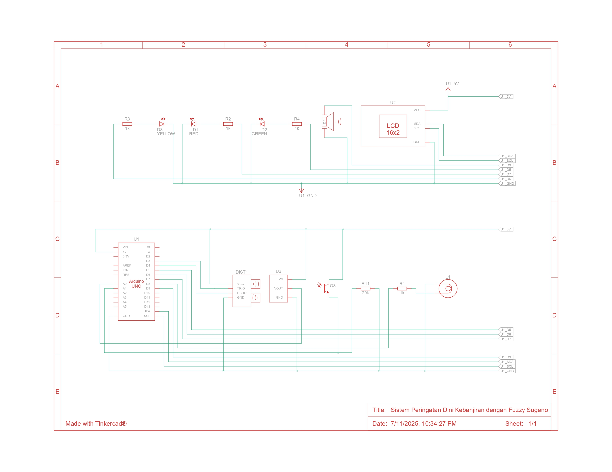

# Flood Early Warning System Using Sugeno Fuzzy Logic

A simple Arduino-based prototype designed to provide early warnings for potential flood conditions using fuzzy logic.

---

## 📁 Project Structure

```
FloodWarningSystem/
├── firmware/              # Arduino code
│   └── flood_warning.ino  # Main sketch
├── pcb/                   # PCB layout
│   └── design.brd
├── images/                # Circuit and simulation screenshots
│   ├── schematic.png
│   └── simulation.png
├── README.md              # This file
```

---

## 📷 Circuit Images

### Schematic



### Simulation


---

## 🧾 Description

This project is a flood early warning system using an Arduino UNO. It uses:

* **Ultrasonic sensor** to measure water level
* **Temperature sensor (TMP36)** and **light sensor** for environmental input
* **LCD** to display status
* **LEDs**, **buzzer**, and **danger lamp** to give visual and sound alerts

Fuzzy logic (Sugeno method) is used to process distance data into a score between 0–100, which determines the alert level.

---

## 🎯 Goal

To build a simple system that can:

* Detect flood risk based on water level
* Notify users clearly through LED and buzzer signals
* Show real-time data on an LCD

---

## 🔧 Required Components

* Arduino UNO
* HC-SR04 ultrasonic sensor
* TMP36 temperature sensor
* Phototransistor
* 16×2 I2C LCD
* LEDs (Red, Yellow, Green)
* Buzzer
* Danger lamp
* Breadboard, jumper wires, resistors

---

## ▶️ How to Use

1. Upload `flood_warning.ino` to Arduino UNO
2. Connect components as shown in `images/schematic.png`
3. Power on the device
4. Watch the LCD cycle through distance, temperature, and light
5. Pay attention to:

   * Green LED = Safe
   * Yellow LED = Caution
   * Red LED or Danger lamp + Buzzer = Warning

---

## 💡 Logic Summary

* Uses **Sugeno fuzzy logic** to decide flood risk from distance input
* Six fuzzy sets from "Very Close" to "Very Far"
* Outputs fixed scores, averaged to produce final risk level
* Different outputs trigger different LEDs and sounds

---
